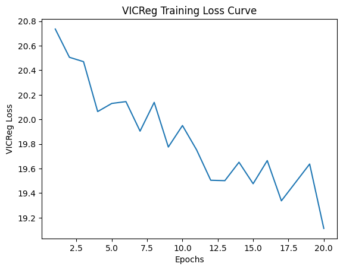

# VICReg implementation

This repository contains a PyTorch implementation of VICReg (Variance-Invariance-Covariance Regularization), as described in the paper by [Bardes et al](https://arxiv.org/pdf/2105.04906).

## Overview

VICReg is a self-supervised learning method that learns image representations without requiring labels or architectural tricks like momentum encoders or clustering. It prevents informational collapse through three explicit constraints:
- **Invariance:** Minimizes the distance between embeddings of two augmented views of the same image.
- **Variance:** Forces the variance of each embedding dimension to stay above a threshold.
- **Covariance:** Decorrelates the dimensions of the embeddings to maximize information capacity.

## Architecture

The implementation uses:
- **Backbone:** ResNet-18 (modified to output 512-d features).
- **Projector:** A 3-layer MLP (2048-2048-2048) with Batch Normalization and ReLU.
- **Dataset:** CIFAR-10.

## Project Structure

- `src/TwoViewTransformClass.py`: Data augmentation pipeline generating two views per image.
- `src/VICRegModelClass.py`: The joint-embedding architecture (Backbone + Projector).
- `src/VICRegLoss.py`: Implementation of the Triple-Loss (Sim, Var, Cov).
- `src/evaluate.py`: Evaluate by training a small classifier over the trained REsNet to evaluate the performance of the model
- `src/main.py`: Training loop 
- folders `data` and `model` are going to be created running main.py

## Installation

```bash
pip install -r requirements.txt
```

## Usage

The script `main.py` supports four different modes:

### Training from scratch

Train a new ResNet-18 with VICReg on CIFAR-10.

```bash
python main.py TRAIN --epochs 20 --batch_size 128 --name my_model.pth
```

### Re-training

Resume training on an existing model.

```bash
python main.py RE_TRAIN --model_path models/my_model.pth --epochs 10 --name my_model_v2.pth
```

### Evaluation 

Freeze the backbone and train a linear layer to check classification accuracy.

```bash
python main.py EVALUATE --model_path model/my_model.pth
```

### Inference

Extract a feature vector from a single batch of images for testing.

```bash
python main.py INFERENCE --model_path models/my_model.pth
```

## Arguments

| Argument | Description | Default |
| :--- | :--- | :--- |
| `mode` | `TRAIN`, `RE_TRAIN`, `EVALUATE`, or `INFERENCE` | (Required) |
| `--epochs` | Number of training epochs | `20` |
| `--batch_size` | Size of the data batches | `128` |
| `--model_path` | Path to a `.pth` file (required for RE_TRAIN, EVAL, INF) | `None` |
| `--name` | Filename for saving the model (saved in `models/`) | `vicreg_model.pth` |

## First results

I did a small test for a 20 epochs training (I do not have any more powerful GPU), plus a 5 epoch classifier head for evalutation and reached final accuracy on CIFAR-10: 58.70%. This accuracy is objectively bad, but we have to remember that I did a very small training (30 minutes) and that the main goal 




## References

Bardes, A., Ponce, J., & LeCun, Y. (2021). VICReg: Variance-Invariance-Covariance Regularization for Self-Supervised Learning.


